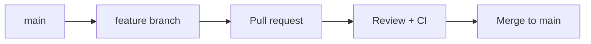

# Contributing

Thank you for contributing to this project. These standards keep history readable and ensure all changes land on `main` through review.

## Workflow overview

1. Branch from the latest `main`.
2. Make focused changes with conventional commits.
3. Open a pull request (PR) — **never push directly to `main`**.
4. Pass CI checks and get approval before merge.



## Branch naming

Use lowercase **kebab-case** after a type prefix:

| Prefix | Use for |
|--------|---------|
| `feature/` | New functionality |
| `fix/` | Bug fixes |
| `chore/` | Tooling, deps, config |
| `docs/` | Documentation only |
| `refactor/` | Code changes without behavior change |
| `ci/` | CI/CD changes |

**Examples**

- `feature/work-page-grid`
- `fix/parallax-mobile-offset`
- `chore/commitlint-setup`

Agent branches from Cursor Cloud Agents use the `agentic<description>-b274` pattern — that is also acceptable.

## Conventional commits

Every commit message must follow [Conventional Commits](https://www.conventionalcommits.org/):

```
<type>(<optional scope>): <short description>

[optional body]

[optional footer(s)]
```

### Types

| Type | When to use |
|------|-------------|
| `feat` | New feature or user-visible behavior |
| `fix` | Bug fix |
| `docs` | Documentation only |
| `style` | Formatting, no logic change |
| `refactor` | Restructure without feature/fix |
| `perf` | Performance improvement |
| `test` | Add or update tests |
| `build` | Build system or external deps |
| `ci` | CI configuration |
| `chore` | Maintenance, tooling |

### Scopes (optional)

Use package or app names when helpful:

- `website` — `apps/website`
- `studio` — `apps/studio`
- `cms` — `packages/cms`
- `ui` — `packages/ui`

### Examples

```
feat(website): add work page project grid
fix(cms): require alt text on project images
chore: add commitlint and husky hooks
docs: document git workflow in CONTRIBUTING
```

### Rules

- Use the **imperative mood** in the subject: `add`, not `added` or `adds`.
- Keep the subject **≤ 72 characters**.
- Do not end the subject with a period.
- Separate subject from body with a blank line when a body is needed.

Commit messages are validated locally by **commitlint** (see [Enforcement](#enforcement)).

## Pull requests

### Opening a PR

1. Rebase or merge the latest `main` into your branch before opening the PR.
2. Fill in the PR template completely.
3. Keep PRs **focused** — one logical change per PR when possible.
4. Add **screenshots or screen recordings** for UI changes.

### Before requesting review

Run these from the repo root:

```bash
pnpm lint
pnpm typecheck
pnpm build
```

For CMS schema changes, also run:

```bash
pnpm cms:typegen
```

Commit any generated type updates in the same PR.

### Merge requirements

- All required CI checks pass.
- At least one approving review (when working with others).
- Branch is up to date with `main`.
- Squash or merge per team preference — prefer **squash merge** to keep `main` history clean if commits on the branch are WIP.

## Protected `main` branch

Direct pushes and merges to `main` are **not allowed**. All changes must go through a PR.

### One-time GitHub setup (repo admin)

If branch protection is not yet enabled, configure it in GitHub:

1. Go to **Settings → Branches → Branch protection rules**.
2. Add a rule for `main`.
3. Enable:
   - **Require a pull request before merging**
   - **Require approvals** (set to 1 if collaborating; 0 if solo but still PR-only)
   - **Require status checks to pass** (add after CI is configured in step 2 of our standards rollout)
   - **Do not allow bypassing the above settings**
4. Optionally enable **Require linear history** if using squash merge.

## Enforcement

| Check | Where |
|-------|-------|
| Conventional commit format | Husky `commit-msg` hook + commitlint |
| PR-only merges to `main` | GitHub branch protection (manual setup above) |
| Lint / typecheck / build | CI (coming in standards step 2) |

After cloning or pulling dependency changes, run `pnpm install` so Husky hooks are installed via the `prepare` script.

## Questions

Open a discussion or issue on GitHub if anything in this guide is unclear or needs updating.
